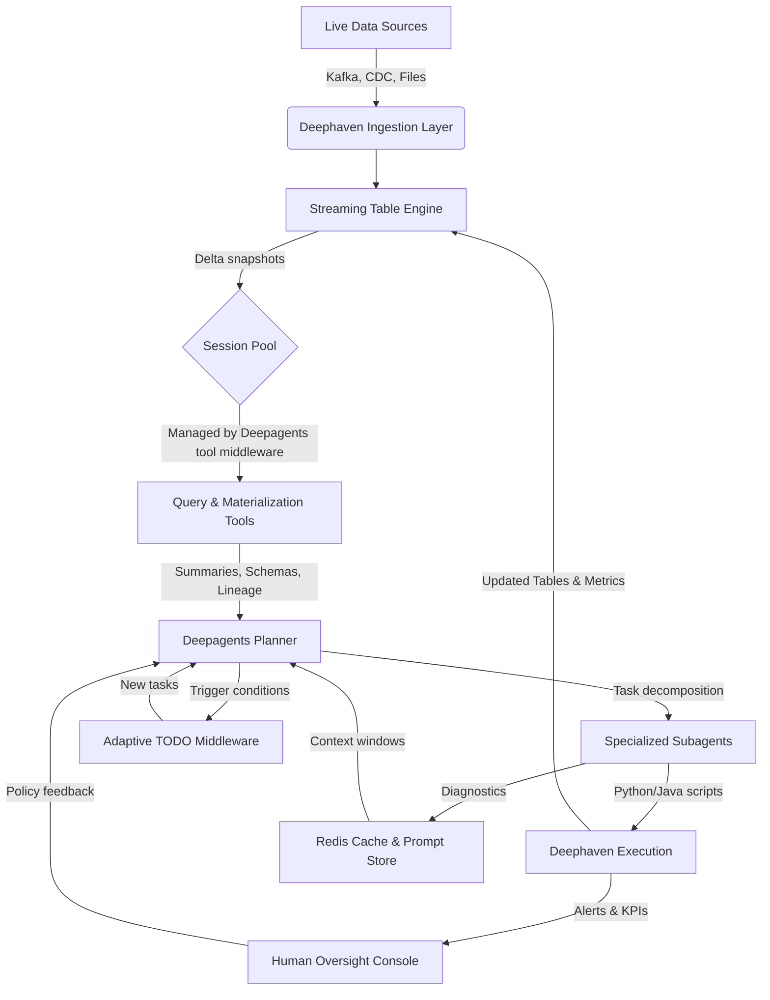

# Deephaven + Deepagents Integration Research

## Executive Summary
Deephaven provides a high-performance, real-time analytics engine built around streaming tables and vectorized query execution, while Deepagents delivers a LangGraph-based orchestration layer with planning, filesystem tools, and subagent spawning for complex workflows.【F:src/deepagents/graph.py†L40-L172】【F:README.md†L83-L99】 Pairing Deephaven's live data infrastructure with Deepagents' autonomous task management enables a stack that can reason over, transform, and operationalize continuously updating datasets without losing context. This document outlines Deephaven's capabilities, maps them to Deepagents' architecture, and proposes concrete integration patterns and implementation blueprints for ultra-efficient intelligent data agents.

## Deephaven Deep Dive

### Platform Architecture (deephaven-core)
- **Streaming Tables**: Deephaven's core engine treats every table as a potentially updating stream, propagating row-level changes through dependency graphs with nanosecond-level timestamps. This design supports low-latency analytics, windowed aggregations, and incremental computation without full recomputation.
- **Query Execution**: The engine executes Python and Java expressions against columnar in-memory tables, using vectorized operations, parallel evaluation, and a query planner optimized for incremental updates.
- **Ingestion & Connectors**: deephaven-core exposes a pluggable ingestion API covering Kafka, CDC sources, Parquet/CSV files, and custom gRPC publishers, allowing unified batch + stream fusion.
- **Server Footprint**: The open-source server runs as a JVM process embedding the engine, web console, and gRPC endpoints, typically deployed via Docker containers with persistent storage for data pages and metadata.

### Client Ecosystem
- **PyDeephaven**: Official Python client built on gRPC + Apache Arrow Flight. It manages authentication, session lifecycle, and shared memory transfers, exposing idiomatic DataFrame-like APIs and direct query execution.
- **Java Client**: Co-resident with the server codebase, useful for embedding Deephaven queries in JVM microservices and enabling custom extension modules in Java.
- **C++ Client**: Offers deterministic, low-latency access for edge or quant workloads where Python's overhead is undesirable. Provides asynchronous table snapshots, delta streams, and schema-aware writers.
- **Web UI & REST**: The bundled console and REST surfaces allow human analysts to monitor the same tables that agents manipulate, enabling human-in-the-loop oversight.

### Distinguishing Capabilities
- **Tick-to-Query Coherency**: Deephaven guarantees consistent snapshots for each query cycle, supporting determinism for AI-driven decisions.
- **Dependency Graph Materialization**: Derived tables maintain lineage metadata, enabling agents to trace and debug transformations, a critical feature for autonomous systems.
- **Extensibility**: User-defined functions can be written in Python/Java, leveraging vectorized primitives or GPU acceleration via plugins.

## Deepagents Architectural Highlights
Deepagents wraps LangGraph to create agents that plan, manage context, and spawn subagents with shared tools and middleware.【F:src/deepagents/graph.py†L40-L190】 The default stack layers Todo list planning, filesystem virtualization, summarization, Anthropic prompt caching, and tool call patching, producing resilient long-running workflows.【F:README.md†L83-L170】 Optional Redis-backed cache and store adapters add persistent memory and high-throughput tool result caching for stateful agents.【F:src/deepagents/graph.py†L112-L188】

Key components relevant to Deephaven integration:
- **Planning & Task Decomposition**: Agents maintain explicit TODO lists, enabling structured multi-step execution when orchestrating data pipelines.
- **Filesystem Middleware**: Provides persistent scratch space for intermediate artifacts, notebooks, or generated code that interacts with Deephaven APIs.
- **Subagent Middleware**: Allows specialization (e.g., a "Query Author" subagent) while preserving global objectives and shared tools.
- **Summarization + Prompt Caching**: Keeps context windows manageable while working with high-volume streaming data logs.

## Integration Opportunities

### 1. Deephaven Tool Suite for Deepagents
- **Query Execution Tool**: Wrap PyDeephaven sessions in LangChain tools to run Python/Java queries, returning summarized diffs or snapshots.
- **Live Subscription Tool**: Stream updates from tables into Deepagents' filesystem (parquet/csv) or message bus for downstream reasoning.
- **Schema & Lineage Inspection**: Tools that surface table schemas, dependency graphs, and update rates, giving agents situational awareness.
- **Ingestion Control**: Manage connectors (start/stop Kafka consumers, adjust throttling) via Deephaven's API for adaptive workloads.

### 2. Autonomous DataOps Workflows
- **Dynamic Feature Engineering**: Agents design and deploy feature pipelines on live market or sensor data, validating transformations via Deephaven's incremental joins.
- **Surveillance & Alerting**: Combine Deepagents planning with Deephaven's streaming filters to detect anomalies, triggering subagents for remediation.
- **Notebookless Research**: Agents iteratively explore data, generate hypotheses, run tests, and persist findings in filesystem-backed reports, mirroring human analyst loops.

### 3. Performance Synergies
- **Co-located Execution**: Running Deepagents middleware near the Deephaven server minimizes gRPC latency and allows zero-copy Arrow buffers when exposed to tools.
- **Cache-Aware Querying**: Align Deephaven snapshot caching with Deepagents' Redis cache to avoid redundant expensive queries while maintaining freshness guarantees.
- **Prompt-Safe Streaming Summaries**: Use summarization middleware to ingest large Deephaven result logs while keeping the LLM within token limits.

## Blueprint for Implementation

### Phase 0 – Foundational Setup
1. Provision Deephaven server (Docker) with secure gRPC endpoint and Arrow Flight enabled.
2. Extend Deepagents deployment with secrets management for Deephaven credentials and cluster addresses.
3. Package PyDeephaven + supporting dependencies within the Deepagents runtime container for tool access.

### Phase 1 – Core Tooling
1. **Session Manager Module**: Implement a middleware or utility that provisions, pools, and recycles PyDeephaven sessions per agent thread.
2. **Query Tool**: LangChain tool that accepts query scripts + parameters, executes against a managed session, and returns structured metadata (schema, row counts, sample rows, lineage references).
3. **Materialization Tool**: Persist Deephaven table snapshots to the filesystem middleware for offline inspection or downstream ML tooling.
4. **Error Diagnostics Tool**: Capture Deephaven exception traces and convert them into agent-readable diagnostics for iterative fixing.

### Phase 2 – Streaming & Reactive Extensions
1. **Subscription Service**: Background task using PyDeephaven's `subscribe` to push updates into an async queue consumed by a Deepagents interrupt-driven subagent.
2. **Adaptive Planning Hooks**: Extend Todo middleware with triggers that insert tasks when Deephaven raises alerts (e.g., latency spikes, schema drift).
3. **Redis Coordination**: Map Deephaven table fingerprints to Redis cache keys so repeated queries reuse cached summaries unless upstream data ticks.

### Phase 3 – Advanced Intelligence
1. **Code Generation Subagent**: Specialized agent that writes Deephaven Python scripts, validated via filesystem tests before deployment.
2. **Policy Engine Integration**: Implement guardrails ensuring only approved operations run (e.g., resource quotas, change management workflows).
3. **Cross-Agent Collaboration**: Use SubAgentMiddleware to orchestrate teams (DataOps, Monitoring, Optimization) sharing Deephaven contexts but with isolated prompts.

## Example Tool Interface Sketch
```python
@tool
async def run_deephaven_query(script: str, *, table: str | None = None, refresh_snapshot: bool = False) -> dict:
    """Execute a Deephaven query and return structured metadata."""
    session = await session_pool.acquire()
    try:
        table_handle = session.run_script(script)
        if table:
            table_handle = session.tables[table]
        result = session.fetch_table(table_handle, max_rows=100)
        return {
            "schema": result.schema(),
            "sample_rows": result.to_pandas().to_dict(orient="records"),
            "size": result.size,
            "ref": table_handle.ticket,
            "refreshed_at": datetime.now(UTC).isoformat(),
        }
    finally:
        await session_pool.release(session)
```

This tool blueprint highlights the need for session pooling, controlled sampling, and metadata capture so that Deepagents can reason about Deephaven outputs without overwhelming the LLM.

## Logic Workflow for Ultra-Efficient Autonomous Analytics



### Workflow Stages and Efficiency Levers
1. **Live Data Harmonization** – Deephaven ingests heterogeneous feeds into coherent streaming tables, eliminating redundant ETL steps and enabling columnar vectorization for low-latency processing.
2. **Session-Oriented Access** – Deepagents maintains a pooled set of PyDeephaven sessions, amortizing connection overhead and granting deterministic, throttle-aware resource allocation across concurrent tasks.
3. **Tool-Driven Interaction** – Query, materialization, and diagnostics tools wrap Deephaven APIs, returning structured metadata that Deepagents can reason over without serializing whole datasets, preserving bandwidth and token budgets.
4. **Planning Feedback Loop** – The planner evaluates tool outputs, decomposes objectives, and coordinates subagents that specialize in feature engineering, monitoring, or remediation. TODO middleware injects new tasks when Deephaven signals schema drift or performance anomalies, keeping workflows adaptive.
5. **Caching & Context Optimization** – Redis-backed caches store query fingerprints, summary embeddings, and prompt state, allowing agents to bypass redundant computation while maintaining narrative continuity via summarization middleware.
6. **Execution & Governance** – Subagents author code or configuration updates applied through Deephaven, while human oversight consoles receive alerts and can inject policy directives, ensuring compliant automation.
7. **Continuous Improvement Loop** – Metrics and lineage data streamed back into the planner inform future task prioritization, enabling the system to iteratively refine feature pipelines, alert thresholds, and resource allocations for compounding performance gains.

This logic workflow illustrates how tightly coupled data streaming, intelligent planning, and adaptive tooling yield a self-optimizing platform that maximizes efficiency, proficiency, interoperability, and performance across real-time analytics workloads.

## Risks & Mitigations
- **Session Exhaustion**: Long-lived subscriptions can exhaust Deephaven session limits. Implement pooling with idle timeouts and subagent etiquette policies.
- **Data Governance**: Autonomous agents manipulating production-grade data require audit logs and policy checks; integrate Deephaven's permissioning with Deepagents' human-in-the-loop middleware.
- **Latency Sensitivity**: Real-time scenarios demand low jitter. Co-locate services, leverage gRPC keepalive tuning, and fall back to snapshot-based workflows when latency budgets are tight.

## MCP Integration Roadmap
The `AssetOverflow/deephaven-mcp` server encapsulates Deephaven capabilities behind the Model Context Protocol, making it an ideal bridge into Deepagents' LangGraph-based orchestration stack. The dedicated integration blueprint in `docs/research/deephaven_mcp_integration.md` details how to package the MCP server, wrap its tools, and elevate it to a core subsystem inside Deepagents.【F:docs/research/deephaven_mcp_integration.md†L1-L208】 Key takeaways include:

- **Baseline Connectivity**: ship the MCP client alongside Deepagents, standardize credentials, and add health probes before agents begin work.【F:docs/research/deephaven_mcp_integration.md†L70-L99】
- **Tooling Layer Enhancements**: adapt tool responses for Deepagents' planner, pool Deephaven sessions, and persist artifacts via filesystem middleware.【F:docs/research/deephaven_mcp_integration.md†L101-L125】
- **Streaming Intelligence**: orchestrate long-lived subscriptions, trigger TODO updates from live events, and align Redis caches with Deephaven table tickets to minimize redundant work.【F:docs/research/deephaven_mcp_integration.md†L127-L148】
- **Implementation Blueprint**: map Deepagents repository touchpoints (new integrations package, middleware, configuration surfaces) and provide module skeletons so engineers can begin work immediately.【F:docs/research/deephaven_mcp_integration.md†L151-L208】
- **Configuration, Testing & Governance**: provide environment templates, deployment manifests, test matrices, and runbook deliverables that enforce policy guardrails while accelerating additional MCP server onboarding.【F:docs/research/deephaven_mcp_integration.md†L210-L248】【F:docs/research/deephaven_mcp_integration.md†L250-L295】

These steps transform Deephaven from an external analytics engine into a deeply integrated execution substrate for Deepagents. The approach also establishes conventions—registry files, response schemas, and security baselines—that future MCP integrations can inherit.【F:docs/research/deephaven_mcp_integration.md†L191-L223】 With the MCP server embedded as a first-class capability, Deepagents gains a foundation for autonomous, streaming-aware intelligence that continuously improves through planning, caching, and subagent collaboration.

## Future Directions
- **GPU-Accelerated Analytics**: Pair Deephaven's GPU plugins with Deepagents-driven model training loops for end-to-end accelerated MLOps.
- **Hybrid Cloud Edge Deployments**: Use the C++ client for edge ingestion while Deepagents coordinates central analytics, enabling resilient, federated intelligence.
- **Semantic Layer Generation**: Teach Deepagents to construct reusable Deephaven query libraries, version them in the filesystem middleware, and publish documentation for human teams.

By merging Deephaven's streaming analytics core with Deepagents' autonomous orchestration, organizations can build ultra-performant intelligent systems that continuously learn from live data, act on insights, and evolve their own analytical playbooks.
